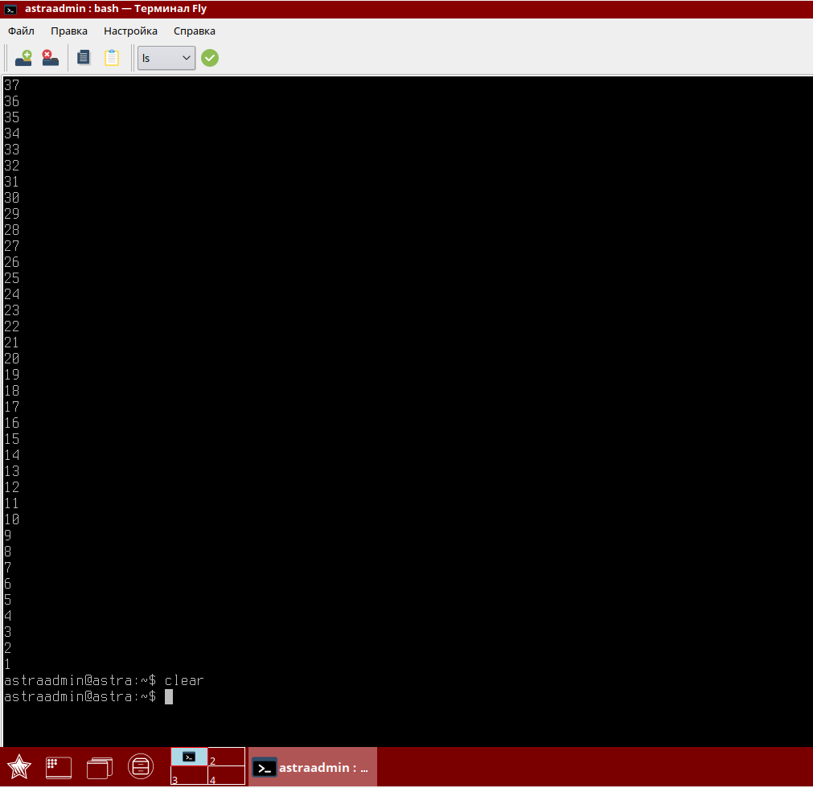

### Баг-репорт

#### ID: BR-002

#### Название:
Команда `clear` не полностью очищает экран терминала

#### Описание проблемы
Команда `clear` должна полностью очищать экран командной строки, оставляя только строку приветствия. Однако, после выполнения команды `clear`, последние 38 строк остаются не удаленными. Команда лишь прокручивает оболочку так, чтобы была видна только строка приветствия, но при прокрутке вверх можно увидеть не удаленные строки.

#### Шаги для воспроизведения:
1. Открыть терминал.
2. Выполнить команду `seq 100 -1 1`.
3. Выполнить команду `clear`.

#### Ожидаемый результат:
Экран терминала должен быть полностью очищен, видна должна быть только строка приветствия.

#### Фактический результат:
Экран терминала прокручивается так, чтобы была видна строка приветствия, но последние 38 строк не удаляются и становятся видимыми при прокрутке вверх.

#### Предполагаемая причина:
Команда `clear` не полностью очищает буфер терминала, а только прокручивает его. Хотя в мануале команды указано `clear очищает экран, если это возможно, включая буфер прокрутки (если определена расширенная возможность "E3")`, даже если предположить что не определена расширенная возможность "E3", то буфер прокрутки не отчищался бы вовсе.

#### Окружение:
- **Операционная система:** Astra Linux SE 1.6 (Smolensk)
- **Ядро:** 4.15.3-1-generic-amd64
- **Версия терминала FLY:** [1.4.5]
- **Версия bash (или другого шелла):** [4.4.12(1)-release (x86_64-pc-linux-gnu)]

#### Вложения:
Демонстрация поведения команды если проскролить в начало терминала.
