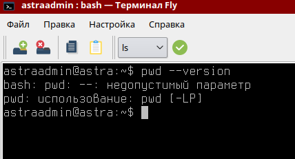

### Баг-репорт

#### ID: BR-003

#### Название:
Команда `pwd` с ключем `--version`

#### Описание проблемы
В мануале каманды `pwd` присутствует описание поведения ключа `--version`, при использовании которого появляется ошибка недопустимого парамера.

#### Шаги для воспроизведения:
1. Открыть терминал.
2. Выполнить команду `pwd --version`.

#### Ожидаемый результат:
На экран терминала выводится версия команды `pwd`.

#### Фактический результат:
На экран терминала выводится сообщение об ощибке `bash: pwd: --: недопустимый параметр`

#### Влияние
Присутствует два источника информации о команде `pwd`, это мануал, который можно вызвать командой `man pwd` и справачная информация о команде, которая выводится при помощи команды `pwd --help`. В мануале присутствует описание поведения ключа `--version`, которое не соотвествует действительности. Такое различие информации в двух источниках может ввести пользователя в заблуждение.

#### Окружение:
- **Операционная система:** Astra Linux SE 1.6 (Smolensk)
- **Ядро:** 4.15.3-1-generic-amd64
- **Версия терминала FLY:** [1.4.5]
- **Версия bash (или другого шелла):** [4.4.12(1)-release (x86_64-pc-linux-gnu)]

#### Вложения:
Демонстрация поведения утилиты `pwd` с ключем `--version`
